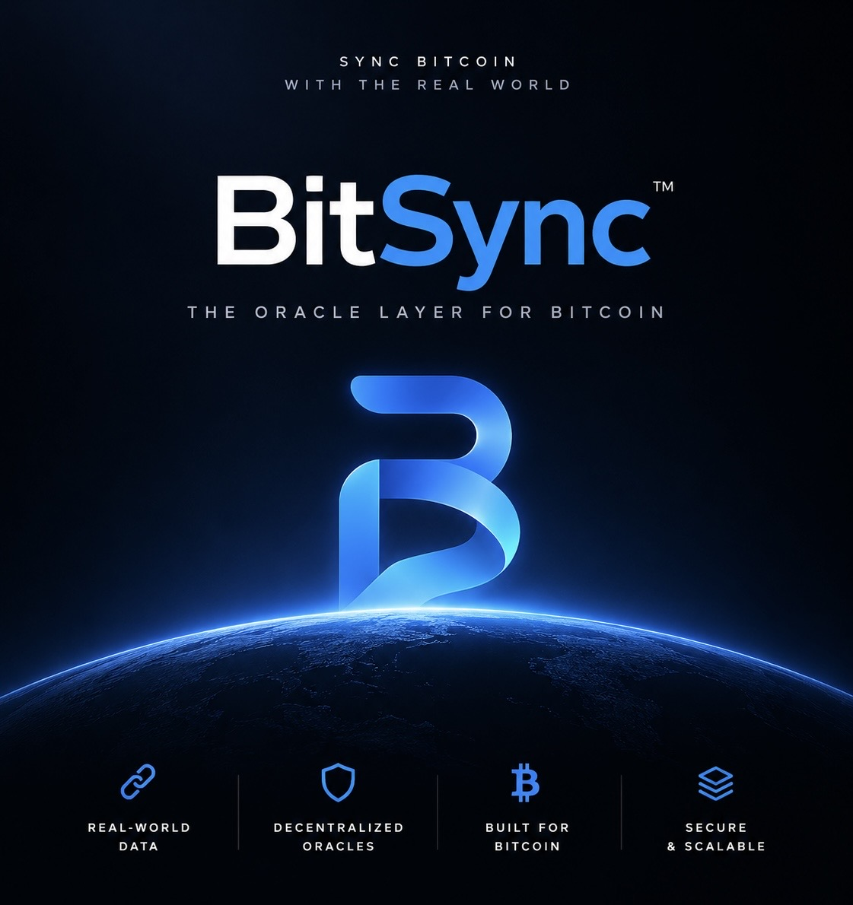
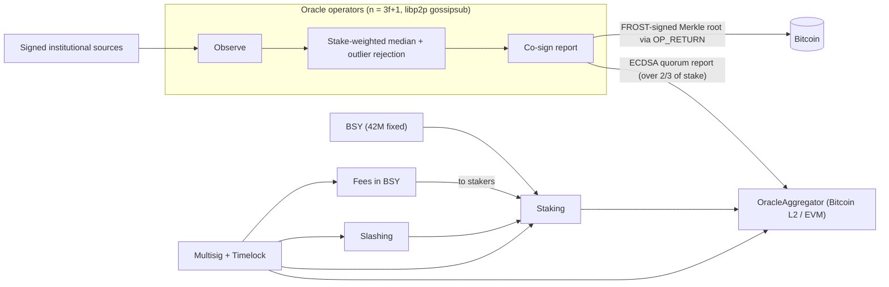

<p align="center">
  
</p>

# BitSync

**The institutional oracle layer for Bitcoin.**

Bitcoin is the most valuable asset in crypto. It still can't see the outside world.
BitSync fixes that: signed institutional data, stake-backed consensus, settled on Bitcoin.

> **Heads up:** this code is **unaudited** and **not mainnet-ready**. Don't point real money at it yet. Details in [Security status](#security-status).

---

## The problem

Bitcoin holds more value than any other chain. But the moment you want to build
anything serious on top of it (lending, structured products, BTC-backed stablecoins,
on-chain treasury tools) you need prices and real-world data you can trust.

Today that data mostly comes from oracle networks built for other ecosystems.
They aren't Bitcoin-settled, they aren't designed around institutional sources,
and the security story usually stops at "trust the committee."

Institutions don't buy "trust us." They want signed sources, economic accountability,
and an audit trail that lives on the most secure ledger there is.

## Our solution

BitSync is an oracle network built for Bitcoin from day one.

- **Signed institutional sources.** Nodes ingest cryptographically signed market data, not scraped APIs.
- **Stake-backed consensus.** Operators bond BSY. A report only counts if operators holding **more than 2/3 of bonded stake** sign it.
- **Real consequences.** Sign two conflicting reports and you get slashed.
- **Bitcoin settlement.** Every round's results are Merkle-rooted and anchored to Bitcoin via `OP_RETURN`, co-signed with FROST threshold signatures.
- **Works where builders are.** Reports are published to Bitcoin L2 / EVM contracts that dApps can read today.

Short version: the data is signed at the source, agreed by people with skin in the game, and receipted on Bitcoin.

## Why now

- **Bitcoin is getting programmable.** Bitcoin L2s and EVM-compatible execution layers are live and growing, and every one of them needs reliable data.
- **Institutions are already in BTC.** The capital is there. The infrastructure to put it to work on-chain with institutional-grade data isn't.
- **The oracle gap is structural.** If the data layer for Bitcoin DeFi isn't Bitcoin-native, the security of the whole stack is only as strong as someone else's chain.

## How it works



1. **Observe.** Each operator pulls signed data from institutional sources.
2. **Agree.** Operators gossip observations over libp2p and run a BFT round (`n = 3f+1`). The aggregate is a stake-weighted median with outlier rejection.
3. **Publish.** The co-signed report lands on-chain. `OracleAggregator` checks the signatures add up to more than 2/3 of bonded stake.
4. **Anchor.** Round results are Merkle-ized and committed to Bitcoin with a tagged `OP_RETURN` payload, threshold-signed with FROST.
5. **Get paid.** Data consumers pay fees in BSY. Fees flow to the stakers securing the feed.

Full deep-dive: [docs/ARCHITECTURE.md](docs/ARCHITECTURE.md).

## What's built today

This isn't a whitepaper. Here's what's in the repo right now.

**Smart contracts** (Solidity / Foundry, [`contracts/`](contracts/))
- **BSY token.** ERC-20 + Permit + Burnable. 42M minted once, no mint function after that.
- **Staking.** Operators bond BSY with an unbonding period. Stake stays slashable while unbonding.
- **Slashing.** Equivocation slashing for both conflicting reports and conflicting observations, with replay protection on evidence.
- **Fee accumulator.** `FeeManager` uses a reward-per-share accumulator, so fees go only to stake that was bonded when the fee was paid.
- **Stake-weighted quorum aggregator.** `OracleAggregator` verifies EIP-712 signed reports and requires **> 2/3 of total bonded stake**, plus a minimum-signer floor.
- **Pause.** Emergency pause on staking, fees, the aggregator and the presale.
- **Timelock governance.** An OpenZeppelin `TimelockController` owned by a multisig sits at the root of on-chain authority.
- **Presale.** `BSYPresale` supports ETH (via price feed) and allowlisted stablecoins, soft cap with refunds, vesting, and optional EIP-712 KYC signatures.

**Oracle node** (Rust, [`crates/`](crates/))
- libp2p gossipsub networking with networked BFT rounds (observe → aggregate → co-sign).
- FROST threshold signatures (secp256k1 / Taproot) for Bitcoin anchors.
- Bitcoin `OP_RETURN` commitment builder.
- Signed source adapters, plus an offline mock fixture.
- Prometheus `/metrics` built in.

**SDKs**
- TypeScript: `@bitsync/sdk` (viem) — [`sdk/typescript/`](sdk/typescript/)
- Rust: `bitsync-sdk` — [`sdk/rust/`](sdk/rust/)
- Both compute the same report digest as the contracts, checked against shared [test vectors](test-vectors/).

**Presale web app** — Next.js, mobile-first, wallet-connected. [`apps/presale-web/`](apps/presale-web/)

**Devnet + monitoring** — four-node Docker Compose devnet with Prometheus and Grafana dashboards. [`deploy/`](deploy/)

**Tests.** Every suite passes locally (run 5 Oct 2026):

| Suite | Tests |
| --- | --- |
| Contracts (`forge test`, incl. fuzz + invariants) | 68 |
| Rust workspace (`cargo test --workspace`) | 35 |
| TypeScript SDK (`npm test`) | 8 |
| Presale web app (`npm test`) | 9 |

## Market opportunity

Every serious financial product needs data. On Bitcoin, the products are
arriving faster than the data infrastructure.

- **Bitcoin L2s and EVM-compatible Bitcoin chains** need price feeds to run lending, derivatives and stablecoins.
- **Institutions holding BTC** want to use it on-chain without lowering their standards for data quality or auditability.
- **Tokenized real-world assets** need a trustworthy link between off-chain prices and on-chain settlement.

Oracles are core infrastructure. Whoever becomes the default data layer for
Bitcoin becomes part of every product built on top of it. That's the position we're going after.

## BSY token

BSY is a **utility token**. It's what secures the network and what you pay with to use it.

| | |
| --- | --- |
| Name / ticker | BitSync / **BSY** |
| Supply | **42,000,000** — fixed, minted once |
| Decimals | **8** (sat-style) |
| Inflation | **0%** — no mint function exists |

**What it's for**
- **Staking.** Operators bond BSY to join the oracle set. More stake, more weight.
- **Oracle security.** Bonded stake is at risk of slashing if an operator misbehaves.
- **Fees.** Data consumers pay for feeds in BSY.

**Allocation**

| Bucket | % | BSY | Status |
| --- | --- | --- | --- |
| Presale | 15% | 6,300,000 | Fixed |
| Ecosystem / rewards | 40% | 16,800,000 | Proposed |
| Treasury / runway | 25% | 10,500,000 | Proposed |
| Early contributors | 20% | 8,400,000 | Proposed |

**Presale:** 6.3M BSY (15%). Suggested price **$0.20 / BSY**, configurable by governance before the sale starts. Nothing here is financial advice or a promise about future price.

Full details: [docs/TOKENOMICS.md](docs/TOKENOMICS.md).

## Business model

Simple:

1. Apps and institutions consume BitSync feeds.
2. They pay fees in **BSY**.
3. Fees flow to the **stakers** securing those feeds.

More usage means more fees, which means a stronger incentive to stake, which
means more security. That's the flywheel.

## Why we win

- **Bitcoin-native by design.** Settlement and audit trail on Bitcoin, not bolted on later.
- **Institutional-grade from the source.** Signed data in, signed reports out, with a verifiable trail end to end.
- **Real economic security.** Stake-weighted > 2/3 quorum and slashing that actually works, enforced on-chain.
- **Serious crypto.** EIP-712 reports, FROST threshold signatures, and a clear path to BLS / FROST-verified on-chain reports.
- **Built, not pitched.** Contracts, node, SDKs, devnet and presale app are in this repo and tested.

## Roadmap

**Now**
- Internal security audit
- Devnet hardening and monitoring

**Next**
- External audit and public bug bounty
- Public testnet with external operators
- Production key management (HSM / remote signer; distributed key generation for FROST)
- Presale launch (post-audit)

**Later**
- BLS / FROST-verified on-chain reports (one signature check instead of many)
- Bitcoin-native BSY representation with a 42M cross-chain supply cap
- Progressive decentralization: BSY-weighted governance alongside, then replacing, the multisig ([docs/GOVERNANCE.md](docs/GOVERNANCE.md))
- Mainnet

## Security status

Straight answer:

- **Unaudited.** No external audit has been completed.
- **Internal audit in progress.**
- **External audit planned** before any mainnet or real-funds deployment.
- **Not mainnet-ready.** Don't use it to secure real funds or production feeds.
- The HSM integration is an interface stub today, and FROST keygen uses a trusted dealer for tests.

Threat model and disclosure process: [docs/SECURITY.md](docs/SECURITY.md).
Found something? Please report it through GitHub Security Advisories, not a public issue.

## Quickstart for developers

<details>
<summary><b>Run it locally</b></summary>

**Prerequisites:** Rust 1.85+, Foundry, Node 18+

**Oracle node**

```bash
# Solo smoke run (in-memory mesh, single-operator committee)
cargo run -p bitsync-node -- --config config/node.toml --once

# Four-node networked test (1 outlier still finalises; 2 faulty halt)
cargo test -p bitsync-node --test networked_rounds
```

**Contracts**

```bash
cd contracts
forge test
```

**TypeScript SDK**

```bash
cd sdk/typescript
npm ci
npm test && npm run build
```

**Multi-node devnet + monitoring**

```bash
cd deploy
docker compose up --build
# Grafana http://localhost:3000  ·  Prometheus http://localhost:9090
```

**Presale demo (local only, mock tokens)**

```bash
./scripts/local-presale-demo.sh          # Anvil + mock deploys + Next.js on :3001
# or
./scripts/local-presale-demo.sh contracts
cd apps/presale-web && npm install && npm run dev
```

**CI:** GitHub Actions workflows for Rust, Solidity and TypeScript are staged in
[`ci/github-workflows/`](ci/github-workflows/). See that folder's README to enable them.

</details>

## Repo layout

```
contracts/      Solidity: BSY, staking, slashing, fees, oracle, timelock, presale
crates/         Rust oracle node: crypto, consensus, p2p, sources, anchor, storage, node
sdk/            TypeScript (@bitsync/sdk) and Rust (bitsync-sdk) SDKs
apps/           Presale web app (Next.js)
deploy/         Docker, 4-node devnet, Prometheus + Grafana
docs/           Architecture, tokenomics, security, governance
test-vectors/   Cross-language report hash vectors
```

Go deeper: [Architecture](docs/ARCHITECTURE.md) · [Tokenomics](docs/TOKENOMICS.md) · [Security](docs/SECURITY.md) · [Governance](docs/GOVERNANCE.md) · [Contributing](CONTRIBUTING.md)

## Get in touch

**Investors, partners, node operators:** we'd love to talk.
Reach out: [add contact]

**Builders:** open an issue or a PR. See [CONTRIBUTING.md](CONTRIBUTING.md).

## License

Apache-2.0. See [LICENSE](LICENSE).
