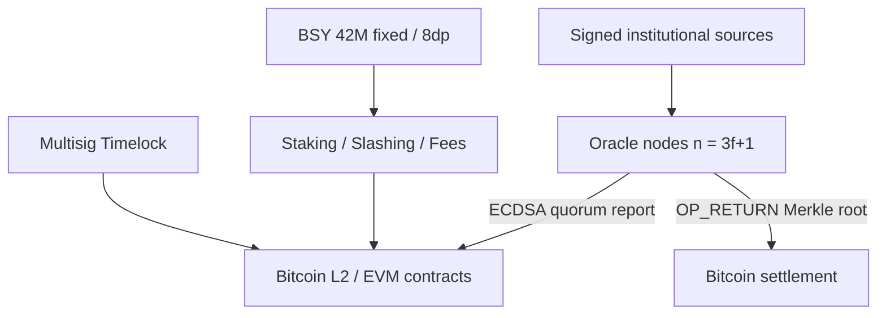

# BitSync Protocol

**The institutional oracle layer for Bitcoin.**

BitSync aggregates cryptographically signed market data from institutional
sources, reaches Byzantine-fault-tolerant consensus among stake-weighted
operators over libp2p gossipsub, publishes reports to Bitcoin L2 / EVM
contracts, and periodically anchors Merkle commitments to Bitcoin itself.
Networked rounds (observe → aggregate → co-sign) are exercised by the
`networked_rounds` integration test and by the compose devnet configs.

> **Security status:** this software is **unaudited** and **not mainnet-ready**.
> See [docs/SECURITY.md](docs/SECURITY.md).

Token: **BitSync (BSY)** — fixed supply **42,000,000**, **8 decimals**,
mint-once, inflation 0%. Utility for staking, oracle security, and fees.
See [docs/TOKENOMICS.md](docs/TOKENOMICS.md).

## Architecture



More detail: [docs/ARCHITECTURE.md](docs/ARCHITECTURE.md).

## Quickstart

### Prerequisites

- Rust 1.85+, Foundry, Node 18+

### Oracle node

```bash
# Solo / smoke (in-memory mesh, single-operator committee)
cargo run -p bitsync-node -- --config config/node.toml --once

# Four-node networked integration test (1 outlier still finalises; 2 faulty halt)
cargo test -p bitsync-node --test networked_rounds
```

### Contracts

```bash
cd contracts
forge test
```

### TypeScript SDK

```bash
cd sdk/typescript
npm ci
npm test && npm run build
```

### Local multi-node net + monitoring

```bash
cd deploy
docker compose up --build
# Grafana http://localhost:3000  Prometheus http://localhost:9090
```

## Repository layout

```
crates/
  bitsync-anchor/       Bitcoin OP_RETURN commitment builder
  bitsync-consensus/    BFT stake-weighted median aggregation
  bitsync-crypto/       EIP-712, ECDSA, FROST, BSY Amount, Signer/HSM stub
  bitsync-p2p/          libp2p gossipsub stack
  bitsync-sources/      Signed source adapters + mock fixture
  bitsync-storage/      IPFS + Arweave archival traits
  bitsync-node/         Oracle node binary + Prometheus metrics
contracts/              Foundry: BSY, staking, slashing, oracle, fees, timelock
sdk/
  rust/                 bitsync-sdk
  typescript/           @bitsync/sdk (viem)
deploy/                 Docker, docker-compose, Prometheus, Grafana
docs/                   Architecture, tokenomics, security, governance
```

## BSY at a glance

| | |
| --- | --- |
| Name / symbol | BitSync / **BSY** |
| Decimals | **8** |
| Max supply | **42,000,000** (`42_000_000 * 10**8` base units) |
| Mint | Once at deployment to treasury; **no mint thereafter** |
| Standards | ERC-20 + Permit + Burnable on Bitcoin L2 / EVM |

## CI

GitHub Actions workflows for Rust, Solidity and TypeScript live in
[`ci/github-workflows/`](ci/github-workflows/) pending a token with the
`workflow` scope. See that folder's README to enable them.

## Governance

Multisig → progressive decentralization. See [docs/GOVERNANCE.md](docs/GOVERNANCE.md).


## BSY Presale (local demo)

Presale contracts live under `contracts/src/presale/`. The institutional marketing site is `apps/presale-web`.

```bash
./scripts/local-presale-demo.sh          # Anvil + deploy mocks + Next.js on :3001
# or
./scripts/local-presale-demo.sh contracts
cd apps/presale-web && npm install && npm run dev
```

Suggested (governance-configurable) price: **$0.20 / BSY** for **6.3M BSY (15%)**. See `docs/TOKENOMICS.md`.
**Unaudited — do not use with real funds.**

## License

Apache-2.0 — see [LICENSE](LICENSE).
