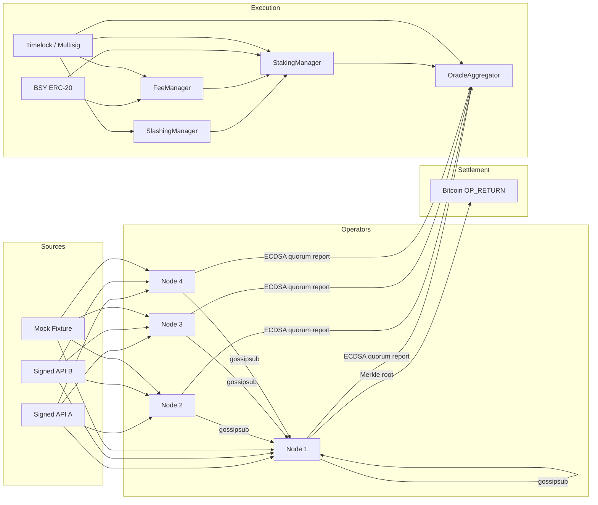

# Architecture

BitSync is an **institutional oracle layer for Bitcoin**. Operators pull
cryptographically signed market data, reach BFT consensus on a stake-weighted
median, publish the aggregate to a Bitcoin L2 / EVM execution environment, and
periodically anchor the round's Merkle root to Bitcoin via `OP_RETURN`.



## Components

| Layer | Crate / package | Role |
| --- | --- | --- |
| Crypto | `bitsync-crypto` | EIP-712 digests, ECDSA, FROST threshold Schnorr, BSY `Amount`, `Signer`/`KeyProvider` (+ PKCS#11 stub) |
| Consensus | `bitsync-consensus` | `n=3f+1` BFT, stake-weighted median, MAD outlier rejection |
| Sources | `bitsync-sources` | Signed institutional adapters + offline mock |
| Storage | `bitsync-storage` | IPFS HTTP + Arweave traits, in-memory impl |
| P2P | `bitsync-p2p` | libp2p gossipsub / noise / yamux / identify / kad |
| Anchor | `bitsync-anchor` | Bitcoin `OP_RETURN` commitment builder (`BSYN` magic) |
| Node | `bitsync-node` | Binary: rounds, archive, Prometheus `/metrics` |
| Contracts | `contracts/` | BSY, staking, slashing, fees, oracle, registry, timelock |
| SDKs | `sdk/rust`, `sdk/typescript` | Typed clients + report verification + BSY helpers |

## On-chain report verification

`OracleAggregator` verifies an **ECDSA quorum** of registered operators over an
EIP-712 digest (`"BitSync Oracle" / "1"`). The Rust and TypeScript SDKs compute
the **same digest**.

**Upgrade path to BLS / FROST-verified reports:** keep the `Report` struct and
feed storage identical; replace the per-operator ECDSA loop with a single
pairing check (BLS12-381) or a FROST-aggregated Schnorr once operator keys are
re-registered under the new scheme. `StakingManager` already stores a `blsPubkey`
field as a reserved slot for that migration. Until then, FROST is used off-chain
to co-sign **Bitcoin anchor commitments**.

## Bitcoin settlement

Each finalised round's signed reports are Merkle-ized (`bitsync-anchor::merkle_root`).
The commitment payload is:

```
magic[4]="BSYN" | version[1]=0x01 | round[8 BE] | root[32]
```

embedded in an `OP_RETURN` output. No custody of BTC is required by the
protocol software in this repository.

## Security status

**Unaudited. Not mainnet-ready.** See [SECURITY.md](./SECURITY.md).
